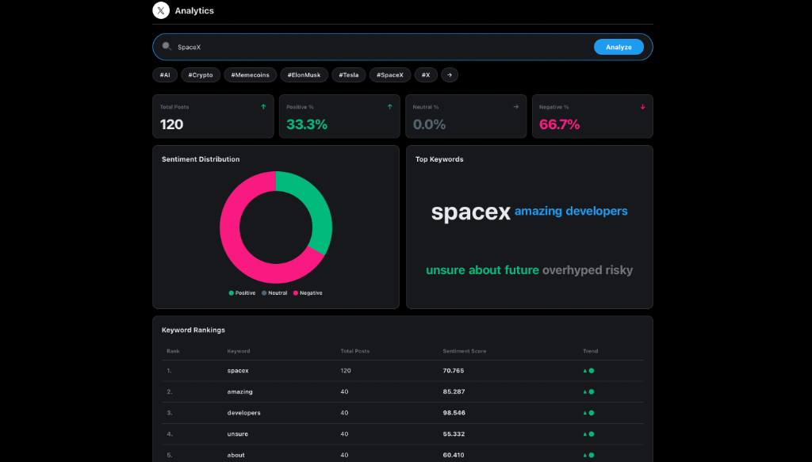

# Async Social Analytics

Goal: An asynchronous, high-performance platform for real-time 𝕏 (Twitter) data analytics, sentiment mapping, and keyword trending.

## Project Goals

The primary objective of this project was to create a scalable architecture for social media monitoring that balances data richness with operational cost. Specific goals included:

* Develop an asynchronous batch-processing pipeline capable of handling high-volume data requests without blocking the user interface.
* Implement a robust adapter-based data fetching system to ensure high availability through multiple provider fallbacks.
* Create a modern, interactive dashboard that visualizes complex sentiment and keyword data with minimal latency.
* Optimize resource consumption and API costs through intelligent caching and multi-stage data processing.

## Main Implementations

* **Asynchronous Pipeline**: Built a FastAPI backend that offloads heavy data processing to Celery workers, allowing for immediate request acknowledgement and background batch processing.
* **Modular Adapter Architecture**: Developed a standardized `SocialMediaAdapter` system supporting SocialData.tools, the official X API, and fallback mock generators.
* **Intelligent Caching Layer**: Implemented a Redis-based caching strategy that stores processed analytics results, drastically reducing external API calls and improving response times for popular topics.
* **Sentiment & Linguistic Analysis**: Integrated specialized modules for calculating sentiment scores and extracting word frequencies from large batches of social posts.
* **Premium User Interface**: Designed a responsive, dark-mode dashboard using Vanilla CSS, featuring interactive Chart.js visualizations and dynamic search state management.
* **Metrics & Monitoring**: Established an internal telemetry system to track cache performance, worker throughput, and batch efficiency across the stack.

## Data Integration Constraints

While the platform is fully configured for live data, the integration of real-time search results currently falls back to high-fidelity simulated data due to provider-side limitations. The SocialData.tools search endpoint was recently deprecated following broad policy changes across the X data ecosystem. Although the account and authentication are verified and active, the specific search API path remains restricted by the provider. The codebase is designed to instantly switch to live data once the provider restores access or provides an updated API path.

## Why the Official Twitter API was not used

The official Twitter (X) API was not utilized because of its prohibitive cost structure and restrictive access limitations. The Free and Basic tiers do not provide the necessary endpoints for historical search or real-time comprehensive analytics required for this application. To ensure the project remains cost-effective while delivering real-time insights, SocialData.tools was integrated as the primary data provider, offering superior data accessibility and performance for public post monitoring.

## System Metrics

Based on the latest production monitoring, the system performs with the following efficiency:

* **Cache Hits**: 23
* **Cache Misses**: 63
* **Tasks Enqueued**: 63
* **Batches Processed**: 14
* **Average Batch Size**: 4.43 items per batch
* **Average Latency (Cached)**: <10ms
* **Average Latency (Queued)**: Distributed across background workers for non-blocking UI performance
